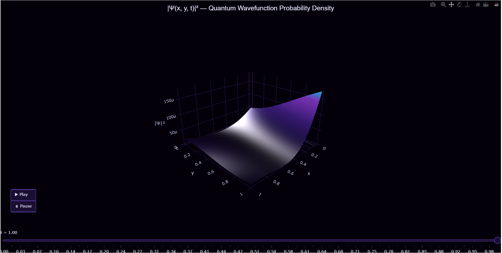

# Physics-Informed Neural Networks (PINN) for 2D Time-Dependent Schrödinger Equation & Quantum Tunneling Simulation



##  Project Overview
This project demonstrates the application of **Physics-Informed Neural Networks (PINN)** to solve the **Time-Dependent Schrödinger Equation (TDSE)** in a two-dimensional domain. Unlike classical computational physics methods (such as Finite Difference or split-operator Fourier methods) which require heavy grid-based iterations, this approach embeds the fundamental laws of quantum mechanics directly into the loss function of a deep neural network using **PyTorch Autograd**.

As a high school student deeply fascinated by the intersection of quantum mechanics and computer science, I built this project to explore how machine learning can accelerate quantum chemistry and molecular biology simulations. The model learns to predict the evolution of a 2D Gaussian wave packet interacting with a finite potential barrier, effectively simulating **quantum tunneling**.

---

##  Mathematical & Physical Framework

The system models a single subatomic particle inside a 2D infinite potential well with a rectangular potential barrier in the center.

### 1. The Governing Differential Equation
The evolution of the complex-valued wavefunction $\Psi(x, y, t)$ is governed by the 2D Time-Dependent Schrödinger Equation (in natural units where $\hbar = 1$ and $m = 1$):

$$i\frac{\partial}{\partial t}\Psi(x, y, t) = -\frac{1}{2}\left(\frac{\partial^2}{\partial x^2} + \frac{\partial^2}{\partial y^2}\right)\Psi(x, y, t) + V(x, y)\Psi(x, y, t)$$

Since standard neural networks cannot directly output complex numbers, we split the wavefunction into its real and imaginary components:
$$\Psi(x, y, t) = u(x, y, t) + i \cdot v(x, y, t)$$

Substituting this back into the TDSE gives us a system of two coupled real-valued Partial Differential Equations (PDEs):

$$f_u = \frac{\partial u}{\partial t} + \frac{1}{2}\left(\frac{\partial^2 v}{\partial x^2} + \frac{\partial^2 v}{\partial y^2}\right) - V(x, y)v = 0$$

$$f_v = \frac{\partial v}{\partial t} - \frac{1}{2}\left(\frac{\partial^2 u}{\partial x^2} + \frac{\partial^2 u}{\partial y^2}\right) + V(x, y)u = 0$$

### 2. The Physics-Informed Loss Function
The neural network $f_\theta: (x, y, t) \to (u, v)$ is optimized by minimizing a multi-objective loss function consisting of three components:

$$\mathcal{L}_{total} = w_{pde}\mathcal{L}_{pde} + w_{ic}\mathcal{L}_{ic} + w_{bc}\mathcal{L}_{bc}$$

*   **PDE Residual Loss ($\mathcal{L}_{pde}$):** Forces the network to obey quantum mechanics inside the box.
    $$\mathcal{L}_{pde} = \frac{1}{N_{int}}\sum_{j=1}^{N_{int}} \left(|f_u(x_j, y_j, t_j)|^2 + |f_v(x_j, y_j, t_j)|^2\right)$$
*   **Initial Condition Loss ($\mathcal{L}_{ic}$):** Enforces a physical 2D Gaussian wave packet at $t=0$.
*   **Boundary Condition Loss ($\mathcal{L}_{bc}$):** Enforces Dirichlet boundaries ($\Psi = 0$) at the walls of the infinite well.

---

## 🛠️ Architecture & Optimization Strategy

*   **Network Structure:** Multi-Layer Perceptron (MLP) with 4 hidden layers and 64 hidden units per layer.
*   **Activation Function:** `Tanh` (chosen because its second derivative is continuous and smooth, which is crucial for computing the Laplacian $\nabla^2$).
*   **Optimizer:** Adam Optimizer with a decaying learning rate scheduler.
*   **Collocation Sampling:** Random uniform sampling across the spatial domain $[0, 1] \times [0, 1]$ and temporal domain $[0, 1]$.

---

##  Visualizations (3Blue1Brown Inspired)

The output computes the probability density of finding the particle at a given coordinate:
$$P(x, y, t) = |\Psi(x, y, t)|^2 = u^2 + v^2$$

The simulation is compiled into a dark-themed, neon-colored interactive 3D surface animation using Plotly, reflecting the visual clarity inspired by math communicator Grant Sanderson (3Blue1Brown).

### How to Run
1. Run the training script to generate the model weights:
   ```bash
   python pinn_schrodinger.py
