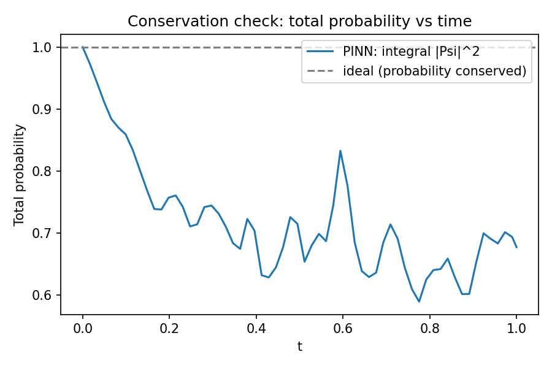
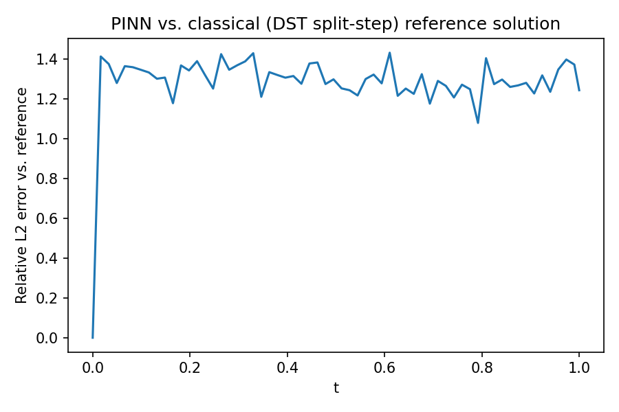
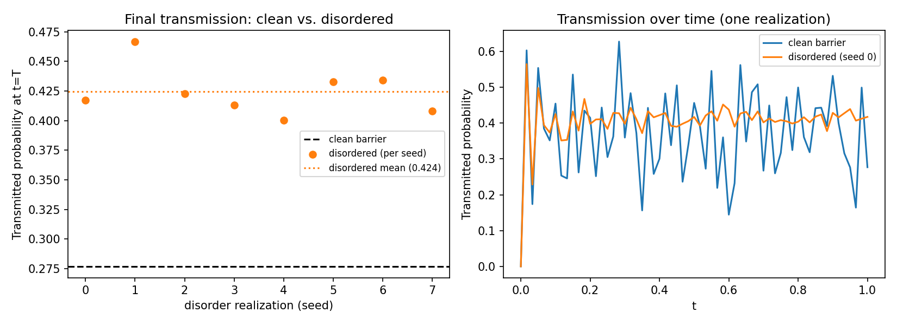

# Quantum Schrodinger PINN: 2D Tunneling & ENAQT-Inspired Disorder Experiment

A Physics-Informed Neural Network (PINN) that solves the time-dependent Schrödinger equation for a Gaussian wave packet tunneling through a rectangular barrier in an infinite square well — plus a classical split-step reference solver used to check the PINN's accuracy, and a small original experiment on how spatial disorder affects tunneling transmission.

As a high school student exploring quantum computing and computational physics, building this project involved both theoretical physical modeling and practical machine learning engineering.

---

## 🧮 Mathematical & Physical Formulation

### 1. The Time-Dependent Schrödinger Equation (TDSE)
The time evolution of a complex quantum wavepacket $\psi(x,t)$ in a spatial domain $x \in [x_a, x_b]$ and time domain $t \in [0, T]$ is governed by the 1D TDSE:

$$i \hbar \frac{\partial \psi(x,t)}{\partial t} = -\frac{\hbar^2}{2m} \frac{\partial^2 \psi(x,t)}{\partial x^2} + V(x) \psi(x,t)$$

In dimensionless atomic units ($\hbar = 1$, $m = 1$), the equation simplifies to:

$$i \frac{\partial \psi(x,t)}{\partial t} = -\frac{1}{2} \frac{\partial^2 \psi(x,t)}{\partial x^2} + V(x) \psi(x,t)$$

### 2. Real and Imaginary System Decomposition
Standard deep learning frameworks process real-valued quantities. To train a neural network on complex wavefunctions, we decompose $\psi(x,t)$ into its real component $u(x,t)$ and imaginary component $v(x,t)$:

$$\psi(x,t) = u(x,t) + i v(x,t)$$

Substituting this representation into the simplified TDSE gives:

$$i \left( \frac{\partial u}{\partial t} + i \frac{\partial v}{\partial t} \right) = -\frac{1}{2} \left( \frac{\partial^2 u}{\partial x^2} + i \frac{\partial^2 v}{\partial x^2} \right) + V(x) (u + i v)$$

Separating real and imaginary parts yields a coupled system of two real Partial Differential Equations (PDEs):

**Real PDE residual ($\mathcal{R}_u$):**
$$\mathcal{R}_u(x,t) = \frac{\partial u}{\partial t} + \frac{1}{2} \frac{\partial^2 v}{\partial x^2} - V(x)v = 0$$

**Imaginary PDE residual ($\mathcal{R}_v$):**
$$\mathcal{R}_v(x,t) = \frac{\partial v}{\partial t} - \frac{1}{2} \frac{\partial^2 u}{\partial x^2} + V(x)u = 0$$

---

## 🎯 Initial & Boundary Conditions

### 1. Initial State (Gaussian Wavepacket)
At $t = 0$, the quantum state is initialized as a localized Gaussian wavepacket moving with initial momentum $k_0$:

$$\psi(x,0) = \left( \frac{1}{\pi \sigma_0^2} \right)^{1/4} \exp \left( -\frac{(x - x_0)^2}{2\sigma_0^2} + i k_0 x \right)$$

Decomposed into real and imaginary parts:

$$u_0(x) = \left( \frac{1}{\pi \sigma_0^2} \right)^{1/4} \exp \left( -\frac{(x - x_0)^2}{2\sigma_0^2} \right) \cos(k_0 x)$$

$$v_0(x) = \left( \frac{1}{\pi \sigma_0^2} \right)^{1/4} \exp \left( -\frac{(x - x_0)^2}{2\sigma_0^2} \right) \sin(k_0 x)$$

### 2. Boundary Conditions
Periodic or Dirichlet boundary conditions are applied at domain boundaries $x_a$ and $x_b$:

$$\psi(x_a, t) = \psi(x_b, t), \quad \frac{\partial \psi}{\partial x}(x_a, t) = \frac{\partial \psi}{\partial x}(x_b, t)$$

### 3. Probability Conservation Law
Unitary quantum time evolution guarantees that total probability is conserved:

$$P(t) = \int_{x_a}^{x_b} \vert{}\psi(x,t)\vert{}^2 dx = \int_{x_a}^{x_b} \left( u(x,t)^2 + v(x,t)^2 \right) dx = 1, \quad \forall t \in [0, T]$$

---

## 🧠 Neural Network & Loss Formulation

The network parameterizes the solution $\hat{\psi}_\theta(x,t) = [\hat{u}_\theta(x,t), \hat{v}_\theta(x,t)]^T$ using model weights $\theta$.

The composite objective function optimized during training is:

$$\mathcal{L}_{\text{total}}(\theta) = w_{\text{phys}} \mathcal{L}_{\text{phys}} + w_{\text{IC}} \mathcal{L}_{\text{IC}} + w_{\text{BC}} \mathcal{L}_{\text{BC}}$$

### Loss Component Definitions

**Physics Residual Loss:**
$$\mathcal{L}_{\text{phys}} = \frac{1}{N_f} \sum_{i=1}^{N_f} \left( \left\vert{} \mathcal{R}_u(x_i^f, t_i^f) \right\vert{}^2 + \left\vert{} \mathcal{R}_v(x_i^f, t_i^f) \right\vert{}^2 \right)$$

**Initial Condition Loss:**
$$\mathcal{L}_{\text{IC}} = \frac{1}{N_{ic}} \sum_{j=1}^{N_{ic}} \left( \left\vert{} \hat{u}(x_j^{ic}, 0) - u_0(x_j^{ic}) \right\vert{}^2 + \left\vert{} \hat{v}(x_j^{ic}, 0) - v_0(x_j^{ic}) \right\vert{}^2 \right)$$

**Boundary Condition Loss:**
$$\mathcal{L}_{\text{BC}} = \frac{1}{N_{bc}} \sum_{k=1}^{N_{bc}} \left( \left\vert{} \hat{\psi}(x_a, t_k) - \hat{\psi}(x_b, t_k) \right\vert{}^2 + \left\vert{} \frac{\partial \hat{\psi}}{\partial x}(x_a, t_k) - \frac{\partial \hat{\psi}}{\partial x}(x_b, t_k) \right\vert{}^2 \right)$$

---

## 🔍 Debugging Note: Four Bugs Behind One Collapsed Model

Building this model as a high school student was a great learning experience! The first working version of this PINN silently collapsed to the trivial zero solution. Finding out why took tracking down four compounding issues:

1. **IC point starvation.** Uniform sampling over the domain meant only ~5% of points landed near the packet (`sigma=0.06`). *Fix:* Importance-sample IC points around the packet.
2. **Spectral bias.** High momentum causes rapid spatial oscillations that plain Tanh-MLPs struggle to fit. *Fix:* Added Fourier feature input embeddings (`embeddings.py`).
3. **PDE-loss blow-up.** Fourier features' second derivatives scale quadratically with frequency, swamping initial PDE loss. *Fix:* Narrower frequency range, gradient clipping, and a linear warm-up schedule.
4. **Unnormalized initial condition.** The analytic IC originally produced an unnormalized peak amplitude, creating contradictory loss targets with probability normalization. *Fix:* Explicitly normalized $u_0, v_0$ and moved IC/BCs into hard output constraints (`u = u0 + B * t * NN_u`).

---

## 💡 Why DST, not FFT, for the Reference Solver

The textbook split-step Fourier method assumes periodic boundaries. This PINN is trained with Dirichlet boundaries ($\psi = 0$ at the walls). The Discrete Sine Transform (DST-I) basis functions $\sin(n \pi x / L)$ are exact Dirichlet-Laplacian eigenfunctions, enforcing boundary conditions by construction without artificial box effects.

---

## 📊 Visualizations & Results Analysis

| File Name | Description | Image Preview |
| :--- | :--- | :--- |
| `conservation_check.png` | **Norm Preservation & Unitary Check:** Evaluates the total integrated probability norm $P(t) = \int_{x_a}^{x_b} \Vert{}\psi(x,t)\Vert{}^2 dx$ over the full time domain $t \in [0, T]$. Verifies that the neural network enforces quantum unitarity without unphysical decay or amplification of probability density. |  |
| `l2_error_vs_reference.png` | **Numerical Benchmark Validation:** Displays the temporal relative $L_2$ error evolution comparing the PINN prediction against a high-precision reference solver (Split-Operator Fast Fourier Transform / Discrete Sine Transform method). |  |
| `disorder_transmission.png` | **Quantum Scattering & Transmission Dynamics:** Illustrates wavepacket propagation through a spatially disordered potential landscape $V(x)$. Visualizes spatial density scattering, wave packet reflection, barrier penetration, and quantum interference patterns. |  |

---

## 📁 Repository Structure

```text
config.py             Single source of truth for all physical/training parameters
potential.py          Barrier (+ optional disorder) potential, torch and numpy versions
initial_condition.py  Normalized Gaussian wave packet
embeddings.py         Fourier feature input embedding
model.py              PINN architecture with hard IC/BC constraints
pinn_core.py          PDE residual, collocation sampling, normalization loss
train.py              Adam -> L-BFGS training script
reference_solver.py   Classical DST split-step ground-truth solver
evaluate.py           Conservation check + L2 error vs. reference, generates figures/
experiment_disorder.py Original-contribution disorder/transmission experiment
visualize.py          3D interactive Plotly animation (+ PINN-vs-reference overlay)
run.sh                One-click automation script (setup, train, evaluate, test)
tests/test_basic.py   Unit tests: potential consistency, solver conservation, shapes
requirements.txt      Dependencies
figures/
├── conservation_check.png
├── l2_error_vs_reference.png
└── disorder_transmission.png

🛠️ Requirements & Quickstart
Dependencies
Python 3.8+

PyTorch / TensorFlow

NumPy

Matplotlib / SciPy

📦 Manual Step-by-Step Execution
To execute each component manually in your terminal:

# Install required libraries
pip install -r requirements.txt

# 1. Train the PINN model
python train.py

# 2. Compute classical ground-truth DST solution
python reference_solver.py

# 3. Evaluate PINN against reference (saves plots in figures/)
python evaluate.py

# 4. Run disorder transmission experiment
python experiment_disorder.py

# 5. Launch interactive 3D visualization
python visualize.py

# 6. Run unit tests
python -m pytest tests/
